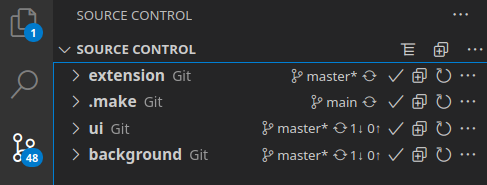

# Table of contents

* [Monorepo guideline](#guideline)
    - [Explanation](#explanation)
        - [What is the Monorepo structure](#-what-is-a-monorepo)
        - [What is a submodule](#-what-is-a-submodule)
        - [Why do we change to the Monorepo structure with submodules](#%EF%B8%8F-why-are-we-migrating-to-the-monorepo-structure-with-submodules)
        - [Blank extension structure](#-blank-extension-structure)
    - [How do I work with the Monorepo](#-how-do-i-work-with-the-monorepo)
        - [Getting Started](#-getting-started)
        - [Committing changes locally](#-committing-changes-locally)
        - [Updating from github](#-updating-from-github)
        - [Creating a new branch](#-creating-a-new-branch)
        - [Switching branches](#-switching-branches)
        - [Keep in Mind](#%EF%B8%8F-keep-in-mind)
    - [Common cases to take advantage of the structure](#common-cases-to-take-advantage-of-the-structure)
* [Appendix](#appendix)
    - [Make commands](#-make-commands)


# Monorepo guideline
 
## Explanation
 
### 🧰 What is a Monorepo?
 
A monorepo is a single repository that stores all of your code for every project, said code generally depends on each other.
 
### 🧰 What is a submodule?
 
Git submodules allow you to keep a git repository as a subdirectory of another git repository. Git submodules are simply a reference to another repository at a particular snapshot in time.
 
### ⚙️ Why are we migrating to the Monorepo structure with submodules?
 
The "blank-extension" original repository is kind of a monorepo but with some issues:
- Single package.json, as result overlapped dependencies
- Cross commitment between background and ui, generating possible testing issues for both teams.
- Confusing directory structure that affects code readability.
 
We decided to use the monorepo structure with submodules to achieve the following:
- Improve code readability.
- Make Testing and code maintenance simpler, improving code quality.
- Make portable packages.
- Provide us with complete, functional and tested releases ready to be used by their related dependencies
- Use independent versioning between packages.
- Diminish CI/CD execution time.
- Achieve autonomy between teams.
 
### ⬆ Blank extension structure
 
- extension (monorepo)
 - .make (submodule with scripts to be used by futures monorepos, you don't need to take care of it)
 - packages
   - background (submodule pointing to extension-background repository)
   - ui (submodule pointing to extension-ui repository)
 
## ⛓ How do I work with the Monorepo?
 
### 🚉 Getting Started
 
When getting started for the first time run the following:
 
```bash
git clone https://github.com/Blank-Wallet/extension
cd extension
git submodule update --init --recursive
make git/branch/checkout BRANCH=master
```
 
```git submodule update --init --recursive``` will initialize all the submodules/packages and it only needs to be run on the first time cloning the monorepo.
From there on everything is managed using the `make` command in the root monorepo folder (this).
 
> 👉 If you want to make changes at Monorepo level, always perform updating, commits, and pushes to github using the `make` command!
 
### ⤴ Committing changes locally
 
To commit your change(s) in any number of submodule(s)/package(s) simply run:
 
```bash
make git/commit-push/all MSG="<my commit message>"
```
 
This will **commit** and **push** changes for each submodule/package under [packages](../packages) _automatically_.
 
### ⤵ Updating from github
 
To pull down changes from github use:
 
> ❌ Make sure you `make git/commit-push/all MSG=<message here>` beforehand
> or `make update` will fail for you.
 
```bash
make update BRANCH=<branch name>
```
 
This will **pull** down changes for each submodule under [packages](../packages) _automatically_.
 
### 🆕 Creating a new branch
 
When you are working on something that does not relate to an existing branch, create one:
 
```bash
make git/branch/new BRANCH=<feat/some-awesome-feature>
```
 
This will create the new branch inside of all [packages](../packages) _automatically_.
 
When you've made your changes, and you're ready to commit see: [Committing changes locally](#-committing-changes-locally)
 
### 📇 Switching branches
 
This will **checkout** the desired branch for each submodule/package under [packages](../packages) _automatically_.
 
```bash
make git/branch/checkout BRANCH=<branch name>
```

### ⚠️ Keep in mind
 
Always check to be in the branch that you want for your packages, otherwise the monorepo will point to the HEAD commit of your packages. All branches are independent among each other.
 
You can check the branches where you are in your git tool.
 
If you are using VSCode you can check this using "source control" label
 


To checkout the monorepo and your modules see: [Switching branches](#-switching-branches)
 
## Common cases to take advantage of the structure
 
In progress


# Appendix

## 🛠 `make` commands

to get the help, you can type ```make``` or ```make help``` at monorepo level

```bash
 $ make

     @@@@@@@@@@@@       
  @@@@@@@@@@@@@@@@@                      /@@@                                 @@@/         
 @@@@            @@@@   /@@@@@@@@@@@@    /@@@                                 @@@/         
@@@@@            @@@@@  /@@@.     @@@@   /@@@                                 @@@/         
@@@@@            @@@@@  /@@@.     @@@@   /@@@    @@@@@@@@@@   .@@@@@@@@@@@.   @@@/  @@@@%  
@@@@@            @@@@@  /@@@@@@@@@@@.    /@@@           @@@@  .@@@*    @@@@   @@@/@@@@*    
 @@@@            @@@@   /@@@.     %@@@,  /@@@    @@@@@@@@@@@  .@@@*    @@@@   @@@@@@@@     
  @@@@@@@@@@@@@@@@@@    /@@@.     (@@@&  /@@@   @@@@    @@@@  .@@@*    @@@@   @@@@ *@@@@   
     @@@@@@@@@@@@       /@@@@@@@@@@@@/   /@@@   &@@@@@@@@@@@  .@@@*    @@@@   @@@/   @@@@* 

Usage: make <target1 target2..> <SOME_VAR=value..>

 Tools:

  🛠 update                          👉 Pull down changes for all repositories.

Global Module Targets (at the monorepo level):

  👉 git/status                      Get the current status of all modules (make git/branch/show).
  👉 git/tag                         Create or replace a new git tag for a single module.
  👉 git/tag/all                     Create or replace a new git tag for a ALL modules.
  👉 git/tag/delete                  Delete a tag for a single module.
  👉 git/tag/delete/all              Delete git tag for a ALL modules.
  👉 git/commit/all                  Commit changes across all modules (does not push!).
  👉 git/commit-push                 Commit and push all changes for module (make git/commit-push MOD=some-module-name MSG="my changes").
  👉 git/commit-push/all             Commit and push all changes for all submodules (make git/commit-push/all MSG="my changes").
  👉 git/branch/new                  Create a new branch across all modules (make git/branch BRANCH=awesome-branch).
  👉 git/branch/checkout             Checkout an EXISTING branch (make git/branch/checkout BRANCH=master).
  👉 git/branch/merge                Merge an EXISTING branch (make git/branch/merge BRANCH=master).

```